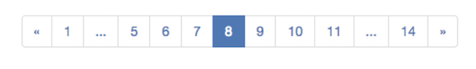

Pagination
==========

A generic pagination package for classic offset/limit style.

[](https://scrutinizer-ci.com/g/TuumPHP/Pagination/?branch=master)

Some interesting features maybe:

*   stores the current page and form inputs in session,
*   can use PSR-7 ServerRequestInterface object,
*   have a flexible pagination HTML generator.

In short, accessing the page with `_page` 

```
http://example.come/pagination?_page
``` 

will restore the last pagination result.  

### PSR

PSR-1, PSR-2, PSR-4, and PSR-7.

### License

MIT license

### installation

Please use composer to install WScore/Pagination package. 

```sh
$ composer require "tuum/pagination: ^1.0"
```


Getting Started with a Sample Code
----

The page key variable, `_page`, is the key. 

### sample HTML form

Let's start with an HTML form for a pagination, for example; 

```html
<form action="">
  <input type="text" name="type" />
  <input type="integer" name="num" />
  <input type="submit" />
</form>
```

Please note that there should be **no `_page` variables**. 

### paginating a query

The simplest way to use a `Pagination` class that combines all the functionalities. 

To instantiate a `Pageinate` object, 

```php
use Tuum\Pagination\Inputs;
use Tuum\Pagination\Pagination;

$pager = new Pager();
$pager->withRequest($request); // PSR-7 server request.
$inputs = $pager->getInputs();

$found = $pdo->prepare("SELECT * FROM tbl WHERE type=? and num>? OFFSET ? LIMIT ?")
    ->execute([
        $inputs->get('type'),
        $inputs->get('num'),
        $inputs->getOffset(),
        $inputs->getLimit(),
    ])
    ->fetchAll();
```

The `Inputs::get*` methods should provides information to construct a query. The `Inputs::setList` method sets the found results inside. 

The `type` and `num` values are: 

* taken from the form input and then saved to a session if no `_page` variables are present in the input query, or 
* taken from a session data (if `_page` is present). 

### `_page` with page number

Requesting with **only the page number** will restore the query values (type and num) from the session, and set the offset value  from the page number. For instance, 

```
GET /find?_page=2
```

will set offset, `(_page-1)*_limit`, with the page number being `2`. 


### query with only `_page`

Requesting with **`_page` but no page number** will restore the page number and other parameters from the session. For instance, 

```
GET /find?_page
```

will set offset to the page number of last request. 


### generating pagination HTML 

The Pagination class implements a `__toString` method to output pagination HTML string. As a default, the Pagination object outputs following style of pagination HTML for Bootstrap ver3. 

```php
echo $inputs;
```



It is possible to change the pagination and HTML/CSS style by 
modifying the pagination logic and html formatter, such that; 

```php
$pages = $inputs->getPagination();
$pages->numLinks = 7;
$pagination = new ToBootstrap3($paginate)
echo $pagination;
```

Technical Details
-----

### setting a total

The pager does not know how to get a total; please supply the total count in the closure inside the call method usging `Inputs::setTotal` method; 

```php
$inputs->setTotal(
    $pdo->prepare("SELECT COUNT(*) FROM tbl WHERE type=? and num>? ")
        ->execute([
            $inputs->get('type'),
            $inputs->get('num')
        ])
        ->fetchColumn()
);
```

### security

As a default, the input values are validated to contain no nulls as well as a valid UTF-8 string. 

To change the validation, you can pass it at the construction of `Pager` as;

```php
$pager->pager->useValidator(function(&$v) {
        $v = 'validate=' . $v;
    });
```

FYI: this is the default closure. 

```php
function (&$v) {
	if (!is_string($v) && !is_numeric($v)) {
        $v = '';
    } elseif (strpos($v, "\0") !== false) {
        $v = '';
    } elseif (!mb_check_encoding($v, 'UTF-8')) {
        $v = '';
    }
};
```

